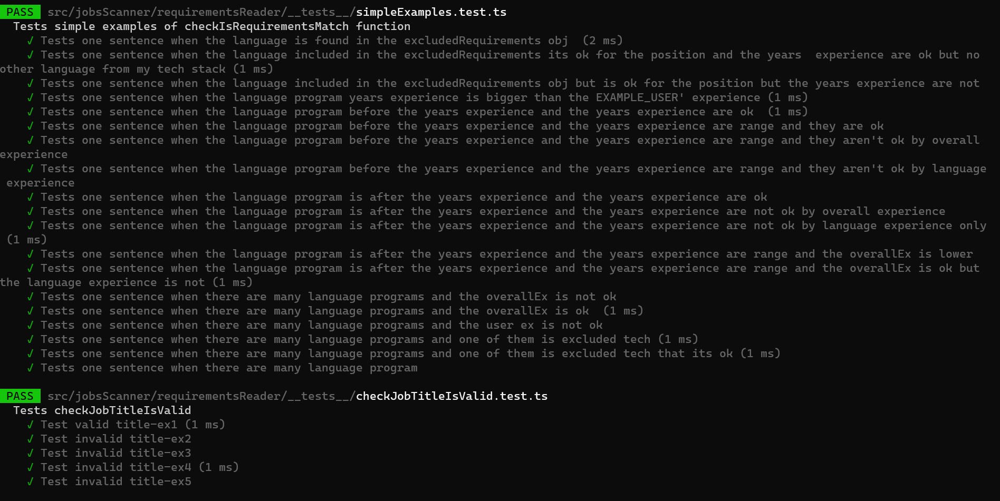

# Jobs Agent Backend:

[Jobs Agent App](https://jobs-agent-rom-orlovich.vercel.app) :point_left:

[Jobs Agent Frontend](https://github.com/rom-orlovich/jobs-agent-frontend) :point_left:

## About My Project:

The Jobs Agent is a web application designed to help job seekers efficiently search for their next job across multiple online sources that provide job listings.
Traditional job searches can be time-consuming and involve sifting through hundreds of irrelevant job listings.

The Jobs Agent addresses this issue by allowing users to fill out their profiles with relevant search queries and using them to scan various job listing sites
to retrieve all relevant job listings in one place.
The system enables users to filter job listings that match their requirements, making the job search process more streamlined and efficient.

This repository contains the backend part of the project, which is responsible for the logic behind job scanning and matching.

# Table of contents

- [**Main Features**](#main-features)
- [**Technologies**](#technologies)
- [**Packages**](#packages)
- [**Main Components**](#main-components)
  - [User](#user)
  - [Scanner](#scanner)
  - [Translator](#translator)
  - [Requirements Reader](#requirements-reader)
  - [Server](#server)
  - [Universal Database With Hash System](#universal-database-with-hash-system)
- [**How It Works?**](#how-it-works)
  - [Scanning](#scanning)
  - [Job Matching](#job-matching)
- [**Installation**](#installation)
- [**Running Docker**](#running-docker)
- [**What's Next?**](#whats-next)
- [**Images**](#images)

## Main Features:

- **Job Listings From Multiple Sites** - The Jobs Agent app scans many job listing sites for new job postings, including Linkedin, GotFriends, Drushim, and AllJobs.
- **Asynchronous Scanning** - The background scanning process is handled asynchronously using RabbitMQ message queuing system to check the scanning status.
- **Smart Job Filtering** - The app includes a requirements reader algorithm that scans job titles and text to filter out jobs that don't match the user's search criteria and to provide a reason for each job that doesn't fit the user's profile.
- **Universal Database** - All jobs are saved in a MongoDB database shared among all app users so that users can search for existing jobs with the same query hash and receive results more quickly.
- **CSV Export** - Users can export all jobs related to a specific query hash to a CSV file for easy analysis and sharing.

## Technologies:

- [Node](https://nodejs.org/api/url.html) - For efficient and scalable development of the application's backend logic.
- [TypeScript](https://www.typescriptlang.org/) - For type checking and improved developer productivity.
- [Docker](https://www.docker.com/) - Containerize the app and deploy into Digtal Ocean cloud.
- [MongoDB](https://www.mongodb.com/) - A NoSQL database that is used to store job listings and user data.

## Packages:

- [Express](https://www.npmjs.com/package/express) - A web framework for Node.js used to create the backend API.
- [Puppeteer](https://pptr.dev/) - For scraping various jobs posts listings sites.
- [Cheerio](https://cheerio.js.org/) - For parsing the HTML due to HTTP requests and extracting job listing data.
- [Axios](https://axios-http.com/docs/intro) - A promise-based HTTP client for the browser and Node.js, used to make HTTP requests to various job listing sites.
- [RabbitMQ](https://www.rabbitmq.com/) - For communication between different systems using messaging queues. It is used in this project for asynchronous communication between different services.
- [json-2-csv](https://www.npmjs.com/package/json-2-csv) - A Node.js package for converting JSON data to CSV format to generate the CSV export file.
- [throat](https://www.npmjs.com/package/throat) - A concurrency limiter for Node.js that controls the number of concurrent requests made to job listing sites.
- [Jest](https://jestjs.io/) - A JavaScript testing framework used to write unit and integration tests for the app.

## Main Components:

### User:

An instance of the user managing the following data:

- **User Profile**:
  For the first time the user uses the app, he creates his unique profile that includes the following parameters:
  - His overall years of experience - The max years of experience the user wants to disqualify a matching job.
  - His job requirements - which domains he wants to include in each job post.
  - His excluded requirement - A list of domains the user doesn't want to include in the job post.
- **User Query**:
  - The user fills in a search query, and its parameters can be shared by other users' queries.
  - These search parameters are hashed uniquely together to locate similar previous queries of other users that relate to specific jobs.

### Scanner:

An instance of a scrapper that scans the content of the jobs listing sites.
Each scanner comprises an instance of GeneralQuery that calculates the scanner parameters from the site filters. It includes methods for fetching jobs, mapping them to objects, and saving them in the database.
The parameters of all the scanners are normalized together by using their similar parameters to create a shared search process.
Each scanner works asynchronously to gather job listings from multiple sources efficiently.

### Translator:

The scanner uses Google Translate API to translate Hebrew text into English.
This helps to overcome the challenges posed by the many inflections and nuances of the Hebrew language.

### Requirements Reader:

After retrieving the data from the database, the requirements reader algorithm scans the
job titles and descriptions to determine their suitability for the user.
The algorithm first disqualifies jobs that violate the user's overall experience, including any excluded keywords.
Then, it checks if the job includes any keywords specified in the user's search requirements.
Finally, the algorithm verifies that no year ranges or digits in the text fall outside the minimum and maximum values specified by the user.
If a job fails these checks, it is disqualified from matching.
Otherwise, it is considered a potential match for the user's job search requirements.

### Server:

The server helps to respond to the user's request and activate the scanner. The jobs filter and download the jobs CSV file.

### Universal Database With Hash System:

To address issues with redundant job documents, scanning efficiency, and data quality,
I implemented a universal database shared by all users while maintaining the ability for users to find their matching jobs.

Rather than saving jobs for each user's profile, the universal database saves jobs for everyone with the same query to save on storage costs.
Each time a user makes a new query, it is hashed by its parameters,
and the hash is inserted into a list of hashQueries that includes all previous queries with the same jobs.

This approach reduces the need to activate new scanners and increases efficiency for users executing the same query.
Additionally, the matching mechanism is performed outside the database, allowing the job document content to remain unchanged so other users can use the same jobs.

After the two-day mark, the same query may bring new jobs, as a new scanner will be activated if there are fewer jobs for that particular query's hash.
This ensures that the data is kept fresh and up to date.

## How It Works?:

### **Scanning:**

When a user makes a new query for a job search, the scanner checks the number of current jobs with the same hash.
If there are fewer than a specific number of jobs with that hash in DB, the scanner scans various job listing sites to gather new job postings, retrieve their details,
and save them to the MongoDB database with the new hash for future similar queries. If there are already more than specific
jobs with the same hash, the scanner skips the scanning process and updates the user's profile with existing job postings for that hash.

### **Job Matching:**

Users can also request a list of jobs that fit their search parameters and display them in the client-side application.
Each time the user makes a GET request for job listings, the server fetches the jobs from the MongoDB database using the current active hash of the user.
The jobs are then processed by my requirements reader algorithm,
which scans the job titles and descriptions and inserts a reason field into each job that tells the user why the job does not match their requirements.
If a job does match their requirements, the reason field is set to "match."
This process helps the user on the client identify which job is fit for him.

## Installation

1. **Clone the repo**
   ```
   git clone git@github.com:rom-orlovich/jobs-agent-backend.git
   ```
2. **Install all the dependencies**
   ```
   npm run ci
   ```
3. **Create .env file**
   ```
   MONGO_DB_URI= <Your URI>
   RABBITMQ_DEFAULT_USER=<Your admin>
   RABBITMQ_DEFAULT_PASS =<Your password>
   ```
4. **Run Server**

   ```
   npm run start
   ```

5. **Go to http://localhost:5000 and have fun**!

## Running Docker:

1. **Clone the repo**
   ```
   git clone git@github.com:rom-orlovich/jobs-agent-backend.git
   ```
2. **Create .env file**
   ```
   MONGO_DB_URI= <Your URI>
   RABBIT_MQ_HOST=<Your host>
   RABBITMQ_DEFAULT_USER=<Your admin>
   RABBITMQ_DEFAULT_PASS =<Your password>
   ```
3. **Run command**
   ```
   docker compose -f docker-compose.dev.yaml up -d
   ```

## What's Next?:

1. Improving the app's scalability to ensure it can handle a high volume of user traffic and implementing a caching mechanism to speed up data retrieval and reduce the load on the database.
2. Implementing a caching mechanism for user requests to speed up data retrieval and reduce the load on the database.
3. Improving the jobs requirement reader algorithm to provide statistics about the jobs that match user preferences and identifying the words that disqualify job listings.

## Images:

### Tests Requirements Reader Algorithm




### Scanners Tests


